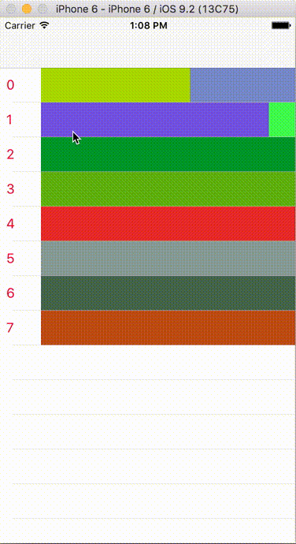

# PageView
The PageView class manages a list of content pages (UIView subclasses) and allows infinite scrolling through those. A one-row layout is supported.

Pages are being dequeued by default. The user has the choice of reusing or instantiating new pages (reusing is however recommended). If multiple pages are being made available for reuse, only a small amount ~2 will be kept.

#Installation
#### With [CocoaPods](http://cocoapods.org/)

```ruby
pod "PageView"
```

# Basic Usage
```Swift
class PageViewCell: UITableViewCell, PageViewDatasource, PageConfigurable {

    @IBOutlet weak var titleLabel: UILabel!
    @IBOutlet weak var pageView: PageView! {
        didSet {
            pageView.datasource = self
        }
    }
    
    override func prepareForReuse() {
        super.prepareForReuse()
        pageView.prepareForReuse()
    }

    func pageBefore(page: UIView, reusablePage: UIView?) -> UIView {
        guard let reusable = reusablePage else {
            return newPage()
        }
        reusable.backgroundColor = randomColor()
        return reusable
    }
    
    func pageAfter(page: UIView, reusablePage: UIView?) -> UIView {
        guard let reusable = reusablePage else {
            return newPage()
        }
        reusable.backgroundColor = randomColor()
        return reusable
    }
    
    func configureWithPage(page: UIView) {
        pageView.setPage(page)
    }
    
    private func newPage() -> UIView {
        let view = UIView()
        print("creating new page")
        view.backgroundColor = randomColor()
        return view
    }
    
    private func randomColor() -> UIColor {
        let r = CGFloat(drand48())
        let g = CGFloat(drand48())
        let b = CGFloat(drand48())
        let color = UIColor(red: r, green: g, blue: b, alpha: 1.0)
        return color
    }
}
```

#Demo


#Licence
Copyright (c) 2015 RFx Software Inc.

Permission is hereby granted, free of charge, to any person obtaining a copy of this software and associated documentation files (the "Software"), to deal in the Software without restriction, including without limitation the rights to use, copy, modify, merge, publish, distribute, sublicense, and/or sell copies of the Software, and to permit persons to whom the Software is furnished to do so, subject to the following conditions:

The above copyright notice and this permission notice shall be included in all copies or substantial portions of the Software.

THE SOFTWARE IS PROVIDED "AS IS", WITHOUT WARRANTY OF ANY KIND, EXPRESS OR IMPLIED, INCLUDING BUT NOT LIMITED TO THE WARRANTIES OF MERCHANTABILITY, FITNESS FOR A PARTICULAR PURPOSE AND NONINFRINGEMENT. IN NO EVENT SHALL THE AUTHORS OR COPYRIGHT HOLDERS BE LIABLE FOR ANY CLAIM, DAMAGES OR OTHER LIABILITY, WHETHER IN AN ACTION OF CONTRACT, TORT OR OTHERWISE, ARISING FROM, OUT OF OR IN CONNECTION WITH THE SOFTWARE OR THE USE OR OTHER DEALINGS IN THE SOFTWARE.